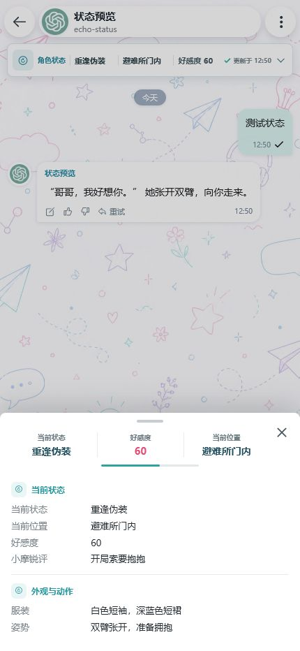
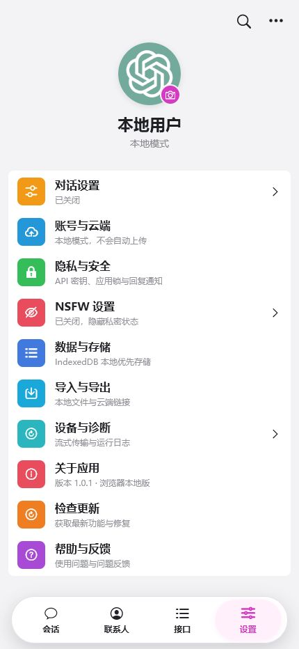

# EchoWeave 织语

<p align="center">
  
</p>

<p align="center">
  本地优先、面向 Android 的自定义 AI 角色对话应用。
</p>

织语是一款为中文角色扮演场景设计的类酒馆应用，基于 Vue 3 与 uni-app 构建。它支持自定义模型接口、角色卡与世界书，并将聊天记录、角色资料和密钥优先保存在本地设备中。

## 应用预览

| 角色对话与动态状态 | 设置与数据能力 |
| --- | --- |
|  |  |

以上均为浏览器预览环境中的真实应用界面，展示了角色对话、动态状态栏、好感度进度，以及本地存储、云端同步、隐私和诊断入口。

## 功能特性

### 模型与对话

- 支持 OpenAI 兼容接口与 Gemini 原生协议，可自动获取并选择模型。
- 支持流式回复、中止生成、失败重试、图片生成和多模态附件。
- 支持从相册、相机和文件管理器添加图片或文本附件。
- API 密钥使用设备密钥加密保存，编辑时默认隐藏并支持按需查看。
- 内置流式传输诊断，可查看首块耗时、事件数量、结束原因和状态协议日志。

### 角色与世界书

- 支持 SillyTavern V1、V2、V3 角色卡及 PNG、JSON 格式导入与导出。
- 支持编辑角色名称、描述、性格、场景、问候语、系统提示词和头像。
- 支持世界书导入、创建、编辑、角色绑定、全局启用及关键词触发。
- 角色详情可直接查看内嵌或关联世界书的规则、触发词和启用状态。
- 自动替换世界书和角色设定中的 `{{char}}`、`{{user}}` 占位符。

### 角色状态

- 每轮回复可解析并更新结构化角色状态，不改变数据库中保存的 AI 原始回复。
- 状态栏支持动态字段、当前位置、好感度颜色进度和分区详情。
- NSFW 开关默认关闭；关闭时仅隐藏私密状态，不删除已保存数据。
- 状态协议请求与响应均可通过诊断日志排查。

### 本地数据与云端

- 浏览器使用 IndexedDB，Android 使用 SQLite 保存会话、角色、世界书和附件。
- Android 大型角色卡、世界书与头像数据采用分块存储，避免 `CursorWindow` 超限。
- 支持本地 JSON 备份、加密云端完整备份和多设备增量同步。
- 云端恢复后自动修复角色、会话和头像关联。
- 支持注册、登录、自定义用户名、云端 JSON 分享链接与跨设备恢复。

### Android 适配

- 使用 Android Keystore 保护设备密钥和敏感配置。
- 提供原生文件选择、相册选择、公共下载目录导出和系统相册保存。
- 提供原生流式请求、SQLite、语音输入、回复通知和 Android 返回键导航。
- 使用多密度应用图标与九宫格开屏资源，适配不同尺寸和比例的手机屏幕。

## 技术栈

| 模块 | 实现 |
| --- | --- |
| 前端 | Vue 3、uni-app、Vite |
| 本地存储 | IndexedDB、Android SQLite |
| 安全 | Web Crypto、Android Keystore、AES-GCM |
| 角色卡 | `@risuai/ccardlib`、SillyTavern V1/V2/V3 |
| 测试 | Node.js Test Runner、Playwright |
| 云端 | PHP API、MySQL、端到端加密备份与增量同步 |

## 本地开发

需要 Node.js 18 或更高版本。

```bash
npm install
npm run dev
```

浏览器预览入口为 `http://127.0.0.1:5173/preview/`。实际端口以 Vite 输出为准。

## 验证

```bash
npm test
npm run build
```

当前自动化测试覆盖模型协议、流式传输、角色卡、世界书、状态解析、云同步、加密备份、Android SQLite 与主要界面交互。

## Android 打包

1. 使用 HBuilderX 打开项目根目录。
2. 确认 `manifest.json` 中已启用 Gallery、SQLite、Speech 和 Push 模块。
3. 通过“运行”连接 Android 模拟器或真机调试。
4. 通过“发行 -> 原生 App-云打包”生成安装包。

应用图标和 Android 开屏资源位于 `unpackage/res/`。修改原生模块、图标或开屏图后必须重新生成 APK，热更新不会替换这些资源。

## 项目结构

```text
pages/          uni-app 页面与 Android 诊断页
src/            核心逻辑、服务、组件和平台适配
static/         Logo、壁纸和离线界面资源
uni_modules/    Android UTS 原生能力
server/         云端 PHP API 与部署配置示例
tests/          自动化测试
docs/           设计、同步方案与项目截图
```

## 安全说明

仓库不包含 API 密钥、云端账号令牌、同步密码或签名证书。模型接口密钥与云端会话在设备端加密保存；云备份内容在上传前完成加密。

完整版本记录见 [CHANGELOG.md](CHANGELOG.md)。
