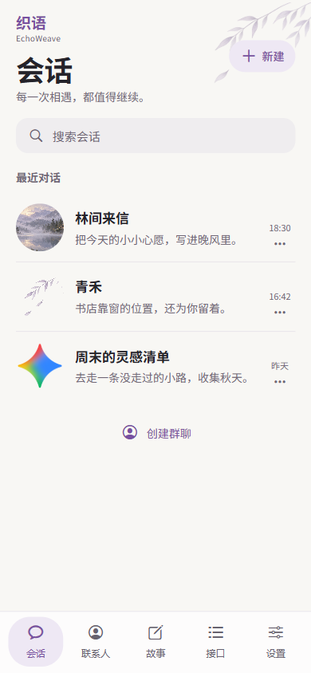
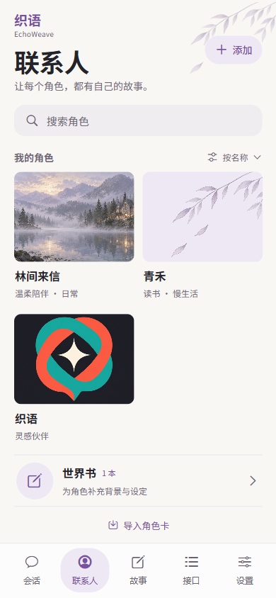
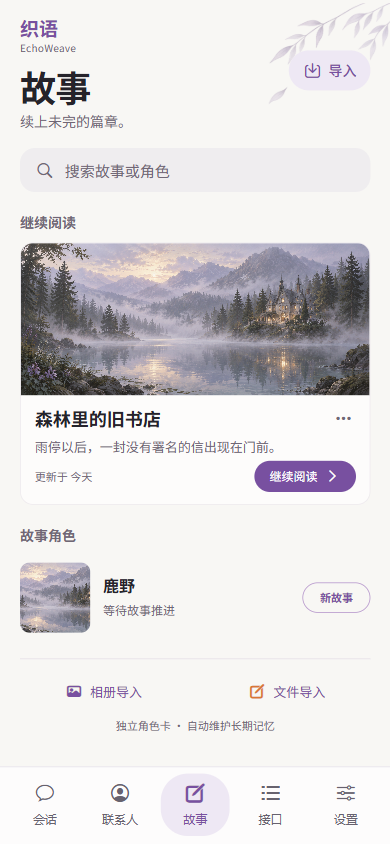
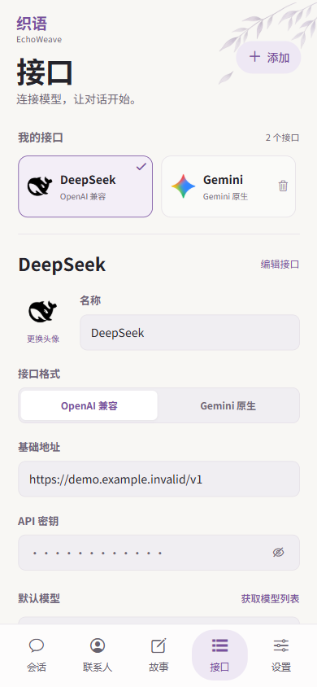
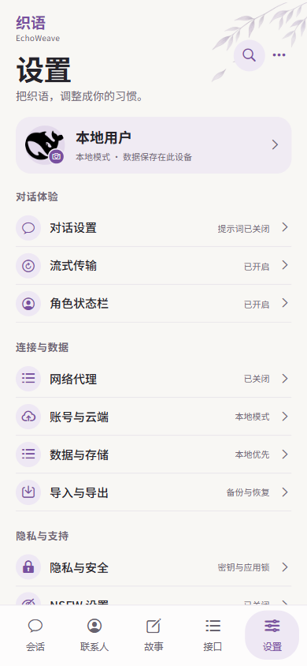
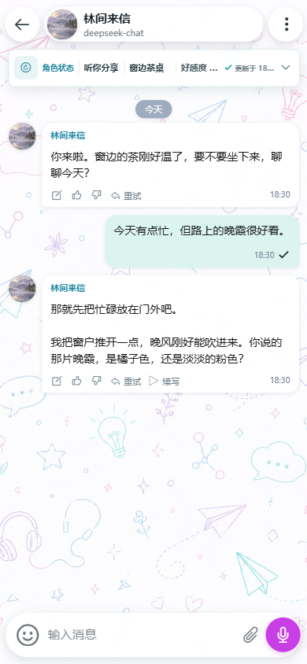
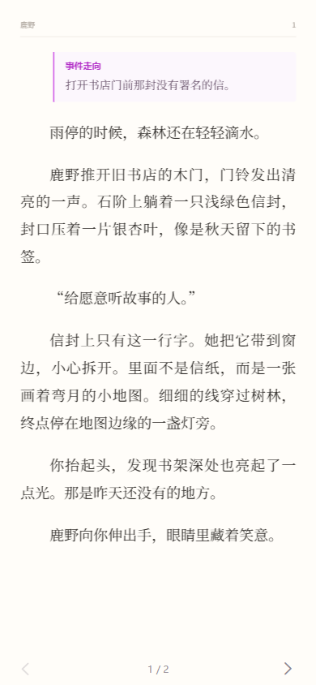

# EchoWeave 织语

<p align="center">
  
</p>

<p align="center">
  <a href="https://github.com/wuhaoyu050721/EchoWeave/actions/workflows/ci.yml"></a>
</p>

<p align="center">
  本地优先、面向 Android 的 AI 角色对话、群聊与长篇故事应用。
</p>

织语是一款为中文角色扮演与长篇叙事场景设计的类酒馆应用，基于 Vue 3 与 uni-app 构建。它支持自定义模型接口、角色卡、世界书、多角色群聊，以及带电子书阅读器和长期设定维护能力的故事模式，并将聊天记录、角色资料和密钥优先保存在本地设备中。

当前版本：**1.1.1**（Android 版本码 `111`）。本版更新了五个主页面与设置子页面，并重点修复空回复诊断、Android 代理和流式生成期间的历史阅读体验。完整记录见 [更新日志](CHANGELOG.md)。

## 运行方式

| 模式 | 是否需要账号 | 数据位置 | 适用场景 |
| --- | --- | --- | --- |
| 本地模式 | 否 | 当前设备 | 单设备使用、无需部署服务器 |
| 云端模式 | 是 | 本地数据 + 加密云备份与同步；可选明文 JSON 分享 | 多设备同步、恢复备份和分享 JSON |

模型请求发往用户配置的模型服务：Android 使用设备网络或所选代理，浏览器开发预览通过本地 Vite 服务转发。EchoWeave 云端是可选组件，只负责账号、加密备份、增量同步和分享，不代理模型对话。完整云备份在客户端加密；JSON 分享则是持链接即可读取的明文数据。

## 应用预览

| 会话首页 | 联系人角色库 | 故事库与续写 |
| --- | --- | --- |
|  |  |  |

| 接口管理 | 设置概览 |
| --- | --- |
|  |  |

<details>
<summary>查看角色对话与故事阅读器</summary>

| 角色对话与动态状态 | 电子书式故事阅读器 |
| --- | --- |
|  |  |

</details>

以上截图来自当前版本的真实浏览器预览界面，使用 390 × 844 手机视口和虚构示例数据，不含用户聊天、账号或真实密钥。浏览器预览用于展示页面，不代表 Android 安装包的真机验收结果。

## 首次使用

1. 打开底部“接口”页面，新建 OpenAI 兼容接口或 Gemini 原生接口。
2. 填写接口地址、API 密钥和模型。模型既可以自动获取后选择，也可以手动输入；保存后可将其中一个设为默认模型。
3. 在“联系人”中导入 PNG 角色卡，或前往在线角色卡制作入口创建角色。
4. 新建单聊或群聊并选择成员。未手动指定模型时，会自动使用已设置的默认模型。
5. 需要长篇叙事时，在“故事”页单独导入故事角色卡并开始故事；输入事件走向，或留空发送让 AI 继续续写。阅读时可在翻页与滚动模式间切换，应用会记住当前位置。
6. 按需在设置中调整流式传输、分段显示、角色状态栏、NSFW、自动同步、回复通知和应用锁。

### 回复显示方式

| 流式传输 | 分段显示 | 实际效果 |
| --- | --- | --- |
| 开启 | 关闭 | 收到模型数据时连续更新当前气泡 |
| 开启 | 开启 | 完整段落逐个显示为气泡，段落之间保留“正在输入”动画 |
| 关闭 | 不显示此开关 | 等待模型完成后一次显示完整回复 |

生成期间可以继续翻阅历史。普通聊天中轻微上翻就会暂停自动跟随；后续正文、分段显示和回复完成都会保留阅读位置。手动滚回实际底部，或点击“回到最新”，才恢复跟随。故事阅读器也会保留正在阅读的位置。

### 网络代理

在“设置 -> 网络代理”中选择使用方式：

| 方式 | 行为 |
| --- | --- |
| Android 智能检测 | 开关立即保存，检测本机常见代理端口，最多等待 2.5 秒；未发现时使用系统网络，是否经过 VPN 由手机系统决定 |
| Android 手动地址 | 填写 HTTP/混合代理地址，点击“保存并使用此地址”后直接启用，不等待自动检测；失败会显示错误，不自动改成直连 |
| 关闭应用代理 | 保留已保存地址，后续请求使用系统网络 |
| 浏览器开发预览 | 本地 Vite 服务按设置使用 HTTP/HTTPS 代理地址；该开发转发能力不等同于普通静态网页部署 |

代理在手机上运行时，地址可以是 `http://127.0.0.1:7890`，端口以代理软件实际配置为准。发现端口只说明端口可连接，不代表代理协议、节点或模型服务已经验证可用。Android 手动代理使用 `http://` 地址，仍可请求 HTTPS 模型接口。

## 功能特性

### 页面与操作体验

- 底部提供会话、联系人、故事、接口、设置五个独立入口，统一页面标题、卡片、导航和状态反馈。
- 设置概览支持搜索入口；设置子页面使用统一的状态摘要、表单、开关与返回路径，数据与存储可查看当前工作区统计。
- 菜单、提示与发送操作提供轻量动画，尊重系统“减少动态效果”设置；支持按压与键盘焦点反馈。
- 普通聊天和故事输入支持 `Ctrl / Cmd + Enter` 发送，`Enter` 保留换行；输入法确认、按住快捷键和空白故事输入不会误发。
- 草稿与待发送附件按工作区及会话隔离，切换会话后保留各自输入，迟到的异步回调不会覆盖其他会话。

### 模型与对话

- 支持 OpenAI 兼容接口与 Gemini 原生协议，可自动获取并选择模型。
- 支持流式回复、中止生成、失败重试、续写、图片生成和多模态附件；流式显示可在设置中关闭。
- 流式传输可选“分段显示”：仅在完整段落生成后逐条弹出独立气泡，段落之间保留对方正在输入动画。
- 模型接口可设为默认模型，新建单聊或群聊时自动选用。
- 支持从相册、相机和文件管理器添加图片或文本附件。
- API 密钥使用设备密钥加密保存，编辑时默认隐藏并支持按需查看。
- 内置流式传输诊断，可查看首块耗时、事件数量、结束原因和状态协议日志。
- 空回复、仅思考或仅状态字段的回复会显示原因及“响应详情”，可查看接收字节、可显示正文数量与结束原因；缺少诊断记录的旧消息不会凭空推断上游结果。
- 发送、重试与续写在准备阶段即防止重复提交；保存失败时保留已有正文并提示，空回复不会触发自动重发。
- 长会话按页动态加载，并使用可变高度虚拟滚动；数据窗口最多保留 240 条消息，DOM 仅挂载视口附近最多 48 条，同时批量、按需加载附件和头像。

### 多角色群聊

- 支持创建 2 至 8 位成员群聊，可混合添加角色卡和不同模型接口。
- 支持成员轮流回复、用户 `@` 指定成员，以及 AI 回复精确 `@` 后自动接力。
- 每位模型接口成员使用自己的协议、地址和模型；接口成员不会读取角色卡或世界书。
- 群聊消息保留独立发言身份，角色状态可按成员切换查看，并限制自动接力次数避免无限循环。

### 故事模式

- 底部导航提供独立“故事”页面，故事角色卡与普通联系人、单聊和群聊成员完全分离。
- 支持从相册或文件管理器导入 PNG 角色卡，并保留角色问候语及卡片内嵌世界书；可直接选择开场并开始故事。
- 用户可以输入事件走向，也可以留空发送或使用续写操作，让 AI 按现有叙事视角继续创作。
- 故事正文使用电子书式阅读器，支持左右翻页与连续滚动两种模式；点击正文中央可显示或隐藏顶部工具栏和底部输入区，减少阅读干扰。
- 翻页模式提供方向一致的过渡动画，滚动模式提供一键到底部操作；AI 生成新内容时不会擅自翻页或改变用户正在查看的位置。
- 阅读位置按故事独立保存，并以段落和字符偏移定位；重新进入故事或在翻页、滚动模式之间切换时会恢复到同一处正文。
- 支持手动添加、查看、跳转和删除书签，书签会随对应故事持久化保存。
- 每轮回复可携带不会显示在正文中的 `<echo_story_memory>` 记忆数据，自动更新剧情摘要、角色长期变化和故事专用世界书，减少长上下文下的设定遗忘。
- 故事对话使用独立叙事提示词，不注入普通角色状态栏协议；自动记忆有数量上限，并在删除故事会话时一并清理。
- 本地 JSON 与加密云端备份会保留故事角色、世界书、长期记忆和会话关联，换设备恢复后自动重映射内部 ID。

### 角色与世界书

- 支持导入 SillyTavern V1、V2、V3 的 PNG 角色卡，导出支持 PNG 和 JSON 格式。独立 JSON 角色卡不支持直接导入；应用 JSON 备份通过“导入与导出”恢复。
- 角色卡导入过程提供解析、保存阶段的加载反馈，避免大型角色卡处理期间界面无响应。
- 支持编辑角色名称、描述、性格、场景、问候语、系统提示词和头像。
- 支持世界书导入、创建、编辑、角色绑定、全局启用及关键词触发。
- 角色详情可直接查看内嵌或关联世界书的规则、触发词和启用状态。
- 普通角色与故事角色使用独立作用域，故事世界书不会混入联系人、群聊成员或普通世界书管理列表。
- 自动替换世界书和角色设定中的 `{{char}}`、`{{user}}` 占位符。
- 联系人页提供在线角色卡制作入口，可直接打开配套制作工具。

### 角色状态

- 每轮回复可解析并更新结构化角色状态，不改变数据库中保存的 AI 原始回复。
- 状态栏支持动态字段、当前位置、好感度颜色进度和分区详情。
- 角色状态栏默认开启，可在设置中全局关闭；关闭后仅请求对话正文，历史状态数据不会被删除。
- NSFW 开关默认关闭；关闭时仅隐藏私密状态，不删除已保存数据。
- 状态协议请求与响应均可通过诊断日志排查。

### 本地数据与云端

- 浏览器使用 IndexedDB，Android 使用 SQLite 保存会话、角色、世界书和附件。
- Android 大型角色卡、世界书、头像、附件及同步状态采用分块存储，避免 `CursorWindow` 超限。
- 支持本地 JSON 备份、加密云端完整备份和多设备增量同步；备份格式完整保留群聊成员、发言身份及故事模式的角色与记忆关系。
- 便携式 JSON 备份导出限制为 50 MiB；云端备份会在密钥派生和加密前估算体积，避免超大数据占满设备内存。
- 云端大文件传输最长等待 10 分钟，上传前会刷新即将过期的登录令牌，并通过进度和诊断日志区分体积超限、网络中断、超时及服务器错误。
- 云同步使用本地修订号与内容哈希识别头像变化，仅在需要上传时读取大型资源。
- 云端恢复后自动修复角色、会话和头像关联。
- 支持注册、登录、自定义用户名、云端 JSON 分享链接与跨设备恢复。
- JSON 分享是持链接即可读取的明文分享，区别于端到端加密的完整云备份。新分享默认七天有效，可在“导入与导出 JSON”中查看有效期并撤销；默认每账号最多 20 条有效分享、总计 500 MiB，过期数据在下次上传或管理分享时清理。
- 应用锁与 PIN 验证记录、设备代理、云端连接配置不随本地备份、完整云备份或增量同步迁移；导入旧备份也会保留当前设备原有的安全设置。
- 临时断网、限流或服务端故障不会直接清空登录凭证；刷新和退出前会核对账号与服务端归属，避免迟到请求影响新工作区。

如果发送或续写后没有正文，消息会显示失败原因，可点“响应详情”查看接收字节、正文与可显示字符数、结束原因，并复制这些统计。记录不包含密钥、提示词或回复原文；没有诊断记录的历史空回复会明确提示无法追溯上游响应。应用不会因空回复自动重发请求。

### 隐私与稳定性

- 可启用 4 至 8 位数字 PIN 应用锁；PIN 使用随机盐和 PBKDF2 哈希保存，应用离开前台后自动锁定。
- 回复通知、自动同步、流式传输、角色状态栏与 NSFW 均使用独立二级设置页，默认状态和作用范围清晰可见。
- 角色卡 PNG 会校验文件尺寸、像素和边长；模型生成图片会校验真实格式、体积、像素和单轮数量。
- 云端登录与注册接口带有持续化频率限制，同步变更历史会定期压缩，避免长期运行后无限增长。

### Android 适配

- 使用 Android Keystore 保护设备密钥和敏感配置。
- 提供原生文件选择、相册选择、公共下载目录导出和系统相册保存。
- 提供原生流式请求、SQLite、语音输入、回复通知和 Android 返回键导航。
- 为旧版 Android WebView 补齐运行时能力，并对聊天记录和联系人列表进行分页及按需渲染。
- 使用多密度应用图标与九宫格开屏资源，适配不同尺寸和比例的手机屏幕。

## 平台支持

| 平台 | 当前状态 |
| --- | --- |
| Android | 主要发布目标，支持 HBuilderX 真机运行与原生 App 打包 |
| 浏览器 | 用于本地开发、功能预览和自动化测试 |
| iOS | 尚未完成真机验证和发布适配，不建议直接用于生产打包 |

## 技术栈

| 模块 | 实现 |
| --- | --- |
| 前端 | Vue 3、uni-app、Vite |
| 本地存储 | IndexedDB、Android SQLite |
| 安全 | Web Crypto、Android Keystore、AES-GCM |
| 角色卡 | `@risuai/ccardlib`、SillyTavern V1/V2/V3 |
| 测试 | Node.js Test Runner、Playwright |
| 云端 | PHP API、MySQL、端到端加密备份与增量同步 |

## 本地开发

需要 Node.js 22.13 或更高版本，推荐 Node.js 24（与 CI 一致）；SQLite 回归测试使用 Node 内置的 `node:sqlite`。

```bash
npm install
npm run dev
```

浏览器预览入口为 `http://127.0.0.1:5173/preview/`。实际端口以 Vite 输出为准。

## 云端部署（可选）

云端功能需要 PHP 8.2 或更高版本、PDO MySQL 和 MySQL/MariaDB。只使用本地模式时可以跳过本节。

1. 按编号顺序执行 `server/migrations/001_initial.sql` 至 `007_expiring_json_exports.sql`。已有部署需先执行新增的 `007`，再更新服务端代码；迁移为既有分享设置从迁移执行时起七天的最后有效期，不影响加密完整备份。
2. 将 `server/config.example.php` 复制为 `server/config.php`，填写数据库连接、公开服务地址和容量限制。
3. 将站点 Web 根目录指向 `server/public/`，并为公开服务配置 HTTPS。
4. 反向代理至少配置 `client_max_body_size 110m`、`client_body_timeout 600s` 和 `fastcgi_read_timeout 600s`。
5. PHP 建议配置 `memory_limit = 512M`、`max_execution_time = 600`，MySQL/MariaDB 配置 `max_allowed_packet = 128M`；否则较大的加密备份可能在进入应用限制前被网关、PHP 或数据库拒绝。
6. 在应用“设置 -> 账号与云端”中填写同一个公开服务地址，再进行注册、登录和同步。

`server/config.php` 已被 Git 忽略，不要提交数据库密码或生产环境配置。客户端会为完整备份和云端 JSON 使用 10 分钟传输超时，并在诊断日志中记录阶段、字节数、耗时与 HTTP 状态。增量同步协议和部署注意事项见 [docs/cloud-incremental-sync-v1.md](docs/cloud-incremental-sync-v1.md)。

## 验证

```bash
npm test
npm run build
npm run test:e2e
npm audit --audit-level=moderate
php server/tests/bootstrap-paths.php
php server/tests/integration.php
php server/tests/json-export-security.php
php server/tests/sync-integration.php
```

首次运行端到端测试前需要执行 `npx playwright install chromium`。当前自动化测试覆盖模型协议、流式传输、单聊、群聊、故事模式、角色卡、世界书、状态解析、云同步、加密备份、Android SQLite 与主要界面交互；GitHub Actions 会在推送和拉取请求中运行 Node.js 测试、生产构建、桌面及 Pixel 7 视口 E2E，以及 PHP 服务端集成测试。

代理测试覆盖原生回调不返回、超时重试、手动路由、取消及禁止重复发送；滚动测试覆盖轻微上翻、触摸回调延迟、分段显示、旧滚动任务和历史加载后的恢复。自动化中的原生接口及触摸事件包含模拟，浏览器构建或手机视口测试不能替代 Android APK 编译和真机网络、触摸验收。

## Android 打包

1. 使用 HBuilderX 打开项目根目录。
2. 确认 `manifest.json` 中已启用 Device、Downloader、File、Gallery、Invocation、NativeObj、SQLite、Speech 和 Push 模块。
3. 通过“运行”连接 Android 模拟器或真机调试。
4. 通过“发行 -> 原生 App-云打包”生成安装包。

应用图标和 Android 开屏资源位于 `unpackage/res/`。修改原生模块、图标或开屏图后必须重新生成 APK，热更新不会替换这些资源。

当前发布配置为 `versionName: 1.1.1`、`versionCode: 111`。发布后续版本时同步修改 `manifest.json`、`package.json`、`package-lock.json` 与 `src/core/app-metadata.js`。本版安装后重点确认手动代理、流式生成期间上翻历史、继续/续写及失败信息；使用云端 JSON 分享管理时，还需完成前述服务端迁移与更新。

## 技术文档

- [文档导航](docs/README.md)：当前维护文档与历史设计记录。
- [当前架构与功能实现](docs/technical-overview.md)：平台适配、消息处理、代理、阅读位置、存储与发布边界。
- [云端增量同步协议](docs/cloud-incremental-sync-v1.md)：同步数据、设备设置隔离和服务端部署要求。
- [角色卡导入验证](docs/character-card-import-poc.md)：角色卡格式与导入设计依据。

## 项目结构

```text
pages/          uni-app 页面与 Android 诊断页
src/            核心逻辑、服务、组件和平台适配
static/         Logo、壁纸和离线界面资源
uni_modules/    Android UTS 原生能力
server/         云端 PHP API 与部署配置示例
tests/          自动化测试
docs/           设计、同步方案与项目截图
```

## 安全说明

仓库不包含真实 API 密钥、云端账号令牌、同步密码或签名证书。模型接口密钥与云端登录凭证在设备端加密保存；完整云备份内容在上传前完成加密。

本地聊天正文、角色资料和附件没有整库加密。应用锁限制进入界面，不等同于数据库文件加密；本地 JSON 导出和云端 JSON 分享也都是明文数据，请按内容的私密程度选择保存与分享方式。

完整版本记录见 [CHANGELOG.md](CHANGELOG.md)。
